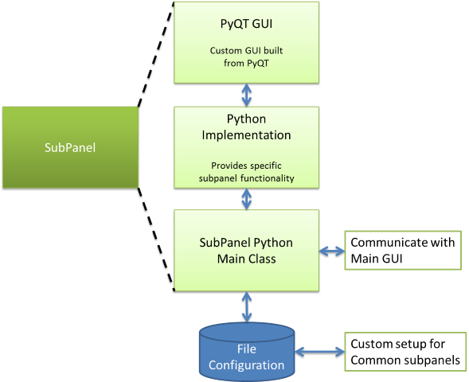

Software Architecture
=====================

The application consists of a communication system to control/configure an AeroQuad flight control board, a main Graphical User Interface (GUI) which allows the user to load dynamic custom subpanels and a file based menu system to allow the developer to show or hide menus/subpanels based on the type of AeroQuad board connected to the Configurator.

.. image:: images/AeroQuadConfiguratorArchitecture_v4.png
   :align: center
   :scale: 80%
   
Each subpanel has existing functions to send commands to the board, read continuous telemetry from the board or read a telemetry value once.  There is a subpanel class which provides access to these common functions, but allows you to easily override them in the event you need to customize their usage based on your own subpanel needs.

   
The subpanel consists of a GUI that is built using PyQt.  After the GUI is designed, Python code is auto generated and used with a developer written Python script to provide the desired functionality such as EEPROM uploading, vehicle status reporting or firmware uploading.  The developer written subpanel script uses a subpanel main class that has functions to communicate with the AeroQuad board via the main Configurator application.
