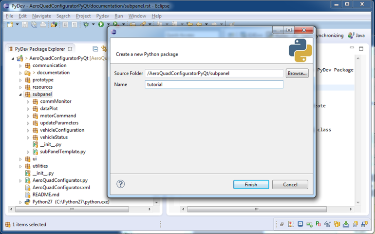

How to Setup Your Own Subpanels
===============================
Here are the steps you can follow to create your own subpanel.  This example will create a subpanel called "tutorial".  You can replace any references to "tutorial" or tutorialWindow" with your desired names.
 
1. In Eclipse, create a new Python package in the PyDev Package Explorer

 a. Right click on the subpanel package
 b. Select New->PyDev Package
 c. Update the dialog box as shown, in the Name field, choose the name of your own subpanel package

   
2. Open the Qt Designer application, in the New Form dialog box, select Widget->Create
 
.. image:: images/createWidget.png
   :align: center
   :scale: 70%
   
3. In Qt Designer, create the GUI for your subpanel

 a. Place a Label on the Form
 b. Place a Push Button on the Form
 c. In the Property Editor, change the name of the QWidget from Form to tutorial
 d. Save the .ui file into the folder created from the previous step
 e. In Eclipse right click in the PyDev Package Explorer and select refresh, your file should appear there
 
.. image:: images/uiWindow.png
   :align: center
   :scale: 80%
   
4. Autogenerate Python code from PyQt

 a. Open up a command window/terminal window and go to the folder where your .ui file is saved
 b. Type "pyuic4 tutorialWindow.ui -o tutorialWindow.py"
 
  * The filename specified after the -o will be the autogenerated UI filename
  
 c. Refresh the PyDev Package Explorer to see the newly created tutorial.py file

  * If you open this file you will find the names of the widgets you can interact with (these can be renamed in Qt Designer)
  * If you ever want to change your GUI, do it in Qt Designer and follow these steps again to update your tutorial.py file 
   
5. Create your subpanel script using the subpanel class

 a. In the PyDev Package Explorer, right click on you package and created New->PyDev Module
 b. Change the text MyClass to the name of your subpanel
 
.. image:: images/createModule.png
   :align: center
   :scale: 80%
   
6. Your module will appear in the PyDev Package Explorer, add the following imports at the top of your code:

::

   from PyQt4 import QtCore, QtGui
   from subpanel.subPanelTemplate import subpanel
   from subpanel.tutorial.tutorialWindow import Ui_tutorial

.. Note::
   This last import listed above is derived from the .ui file you created in the QtDesigner, the package and the module you created in Eclipse

   * The first part is subpanel.<your Python package name>.<your UI filename from step 4b>
   * The last part is found inside tutorialWindow.py and is the class name (the name of the QWidget from step 3c)

   